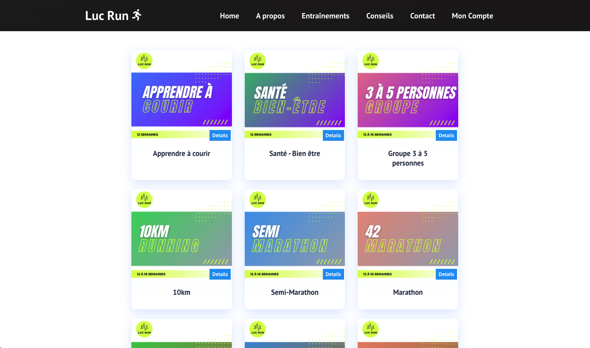

# React.JS LucRun Running WebApp

Fully responsive Running app, where I practice my skills using the React.js framework, Bootstrap and more...

## ⚙️ Technologies Used

- React.js
- JavaScript
- HTML5
- CSS/Bootstrap
- GitHub
- Netlify

## 📷 Screenshots

- Website

- Website/2

## 🔌 Getting Started
[Click](https://lucrun.netlify.app/) to get started and see the app live!

## 🛠 Future Enhancements

- Accept Paypal payments.
- Integrate running events API.